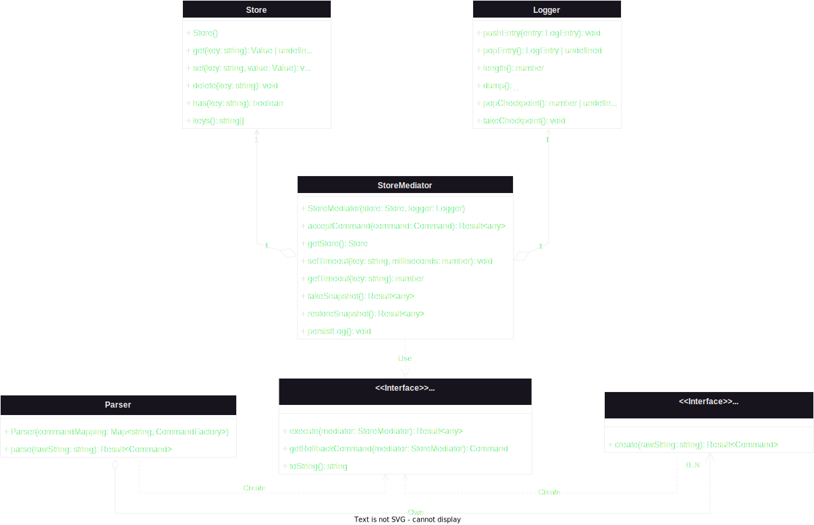

# light-weight-redis (Ledis)

A simple & light-weight simulation of Redis, which is part of a company assignment.

This README file is meant to explain the components of the system and how to extend it.

One of the advantages of this design is that the system can be extended with new commands with minimal/trivial modification to the source code.

## System components

Here's a class diagram of the system. The main components are shown.

Some components that are not defined in the diagram:

* A `Value` is either a `Set`, a `CircularQueue` (representing a **List**) or a `string`.
* A `LogEntry` contains a `forwardCommand` and possibly a `backwardCommand`.
* A `Result<T>` contains a value of type `T` or an error or a message.

More on the components and their relationships:

* A `Store` is where the key-value mappings reside. It supports basic dictionary operations (get, set, delete).
* A `Logger` is where any commands that cause a state change of the system reside, within a log entry along with a rollback command which on executed, would rollback the effect of the former. It supports pushing/popping `LogEntry` and taking/popping a checkpoint.
* A `StoreMediator` is the object that owns a `Store` and a `Logger`. It is the object where all commands are accepted into and passed the context of its `Store`. It also supports snapshots and setting expiration time on keys.
* Each command is represented by a `Command`. Each `Command` can be executed given a `Mediator` as the context. It can also generate a rollback command of itself giving the context.
* A `CommandFactory` is an object that creates a `Command` by parsing a raw string.
* A `Parser` maintains a mapping from a command name to a `CommandFactory` in order to parse any raw string.

## Data structures

* The **key-value mappings** are stored using the Javascript built-in `Map`, which supports sublinear dictionary operations.
* A **list** value at a key is internally stored as a `CircularQueue`, which supports constant-time  random access, constant-time popping and amortized constant-time pushing at either head of the queue.
* A **set** value at a key is stored using the Javascript built-in `Set`, which supports sublinear dictionary operations.
* The **log** is stored as a Javascript built-in `Array` to support constant-time stack operations.

## How to extend the system?

More commands can be added by:

* Create your `Command` subclass in a file stored in `./src/lib/commands/commands_imp/`.
* Create your `CommandFactory` subclass in a file stored in `./src/lib/commands/factories/` that's capable of parsing a raw string to return your `Command` subclass. An utility function named `extractToken` stored in `./src/lib/utils/extractToken.ts` can be used to easen the tokenizing step.
* Add an entry corresponding to your command in `./src/lib/commandMapping.ts`.